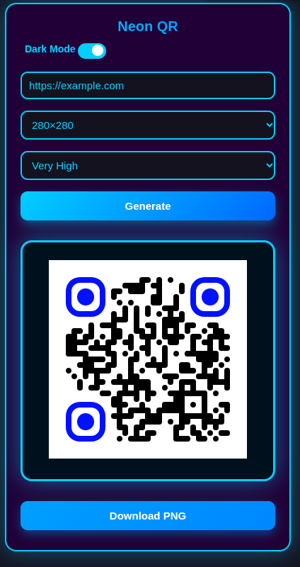

# Neon QR Generator – One Single HTML File

Just open → type → generate → download.  
Beautiful, 100% scannable, works offline after first load.

### Features
- Fixed deep-blue corners (`#0008ff`) with black rounded dots → scans perfectly on every phone  
- Pure white background → maximum reliability  
- Gorgeous dark mode with neon-blue glow  
- Size selector & high error correction  
- Instant PNG download  
- Everything fits on one screen  
- Works 100% offline after the first time (library is cached)  
- Zero installation – just double-click the HTML file!

### How to use
1. Download **`neon-qr.html`** from this repository  
2. Double-click the file → opens instantly in your browser  
3. Enter text or URL → click **Generate** → download!

Works on Windows, Mac, Linux, Android, iPhone – anywhere a browser runs.

### Files
- `neon-qr.html` – the only file you need  
- `screenshot.jpg` – preview

### Try it now
Open it directly in your browser:  
[neon-qr.html](neon-qr.html)

### License
Free to use, share, and modify.

Enjoy your perfect blue QR codes!
